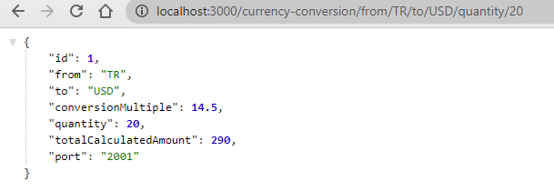

# Table of Contents
- [Overview](#overview)
- [Application List](#application-list)
- [URLs](#urls)
- [Load Balancing](#load-balancing)
- [Postman Collection](#postman-collection)
- [Licence](#licence)
- [Errors](#errors)

# Overview
Spring Boot based project to demonstrate microservice implementation.
Centralized Config Server retrieves properties from git repository: [Config Repository](https://github.com/muratcanabay/config-repo)

### Spring Profile
Switch ***spring.profiles.active*** in the in [api-limit-service](api-limit-service/src/main/resources/application.yaml) properties file between **dev/test** to see the change.

### Application List

| Application                 | Port |
|-----------------------------|------|
| Limits Service              | 1000 |
| Currency Exchange Service   | 2000 |
| Currency Conversion Service | 3000 |
| Circuit Breaker             | 4000 |
| Spring Cloud Config Server  | 8888 |
| Spring Cloud Gateway        | 8765 |
| Eureka Config Server        | 8761 |

### URLs

| URL                                                                  | Description                                |
|----------------------------------------------------------------------|--------------------------------------------|
| http://localhost:1000/limits                                         | ***Api Limit Service***                    |
|                                                                      |                                            |
| http://localhost:8888/api-limit-service/test                         | ***Config Server Test Properties***        |
| http://localhost:8888/api-limit-service/dev                          | ***Config Server Development Properties*** |
|                                                                      |                                            |
| http://localhost:2000/h2-console                                     | ***h2 Database Console***                  |
| http://localhost:2000/currency-exchange/from/TR/to/USD               | ***Currency Exchange Api***                |
| http://localhost:3000/currency-conversion/from/TR/to/USD/quantity/10 | ***Currency Conversion Api***              |
| http://localhost:4000/sample-api                                     | ***Circuit Breaker Api Retry***            |
| http://localhost:4000/sample-api-v2                                  | ***Circuit Breaker Api Rate Limiter***     |
|                                                                      |                                            |
| http://localhost:8761                                                | ***Eureka Server***                        |

| Api Gateway URL                                                      | Description                                |
|----------------------------------------------------------------------|--------------------------------------------|
| http://localhost:8765/currency-exchange/from/TR/to/USD               | ***Currency Exchange Api Over Gateway***   |
| http://localhost:8765/currency-conversion/from/TR/to/USD/quantity/10 | ***Currency Conversion Api Over Gateway*** |
| http://localhost:8765/sample-api                                     | ***Circuit Breaker Api Over Gateway***     |
| http://localhost:8765/sample-api-v2                                  | ***Circuit Breaker Api Over Gateway***     |

### Load Balancing

Feign Client uses the load balancer inside Eureka Client dependency to share request traffic between application instances.

### Postman Collection

[Postman Collection](spring-microservice-example.postman_collection.json)

### Licence

[MIT](LICENSE.MIT)

### Errors
#### In case of ***java: variable first not initialized in the default constructor***

Make sure to Enable Lombok Annotation Processing
 
