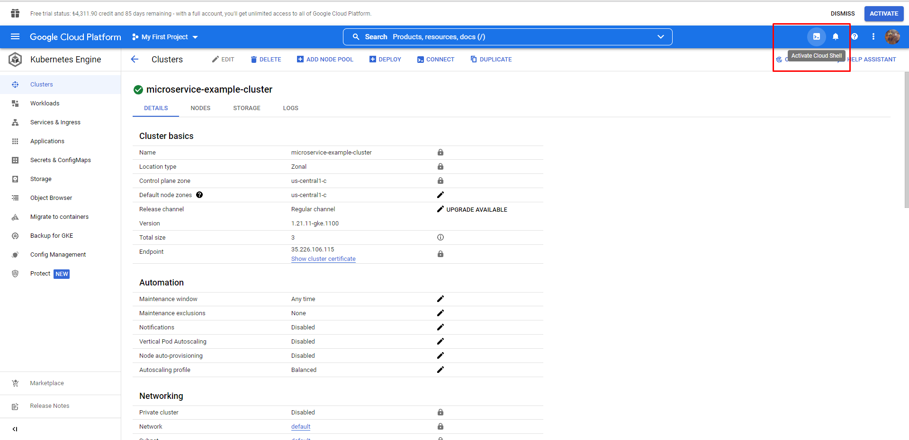
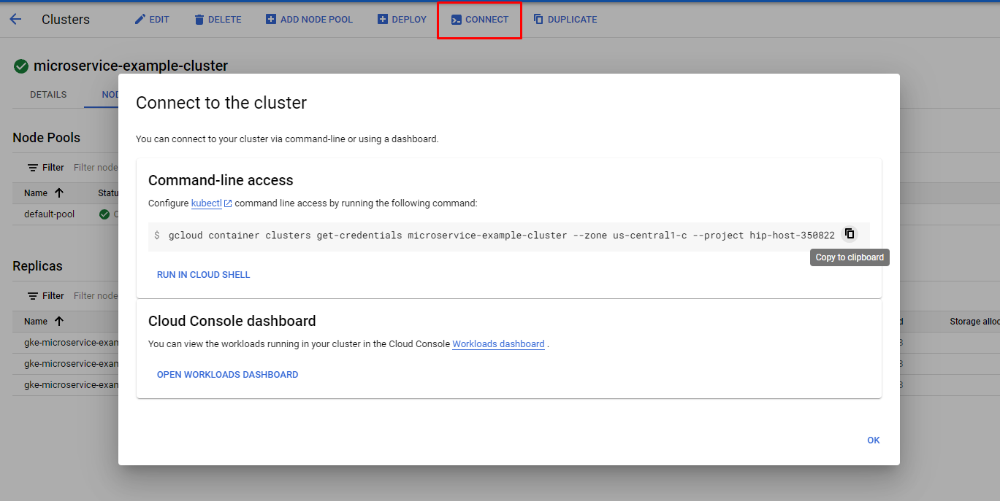
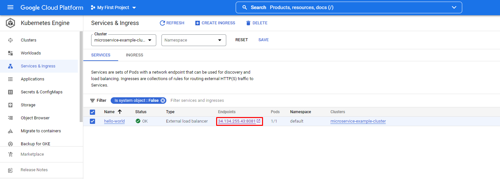
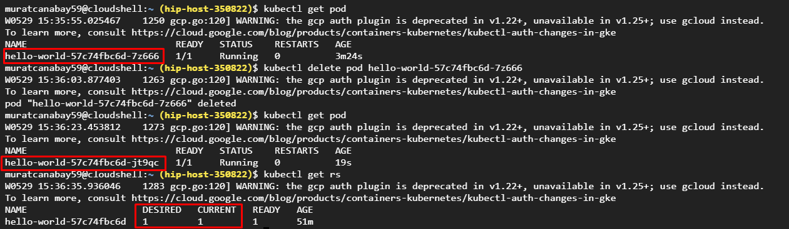
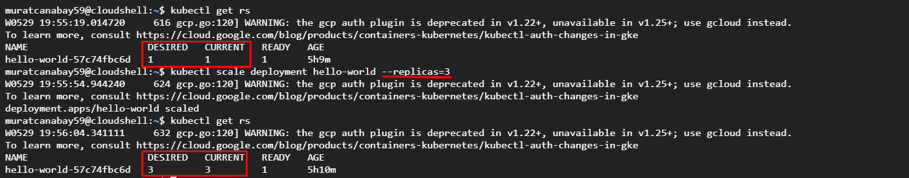
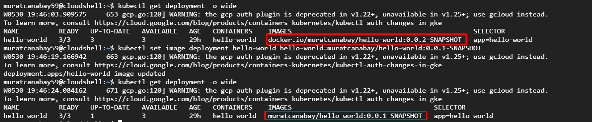
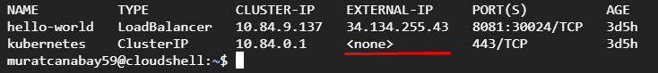
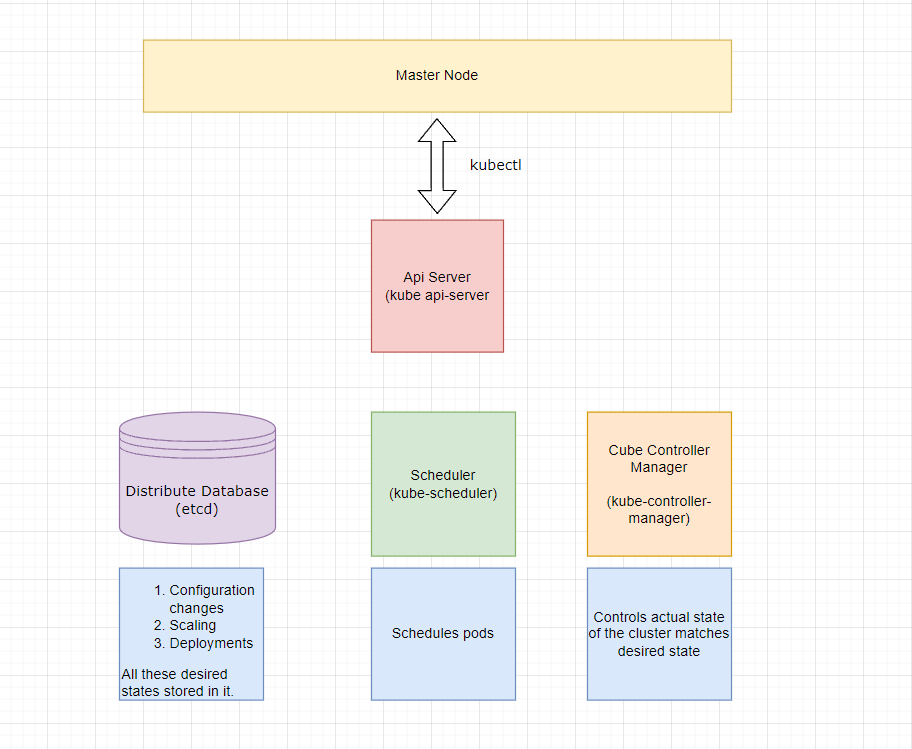
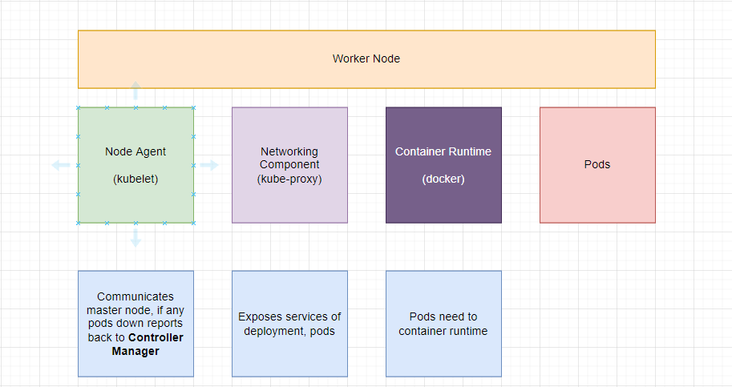

## Google Cloud Platform (GCP -> GKE)

1. Search Kubernetes Engine and Create a cluster
2. Open Activate Cloud Shell to Run a Command

3. Press Connect cluster button copy command and paste into shell


#### How to deploy an app ?

1. Create a deployment named hello-world that runs the **muratcanabay/hello-world:0.0.2-SNAPSHOT** image
```
kubectl create deployment hello-world --image=docker.io/muratcanabay/hello-world:0.0.2-SNAPSHOT
```

2. Create a service for a hello-world deployment, which serves on port 8081 and configure LoadBalancer
```
kubectl expose deployment hello-world --type=LoadBalancer --port=8081
```

3. To check availability of your container, go to Services & Ingress 


#### Pods
Smallest deployable unit in k8s. <br>
Pod is a collection of containers that can run on a host.

#### Replica Set
Always keeps monitoring pods and if there are lesser number of pods exists than needed then it creates new pod.
* Delete pod to see auto creation if desired lesser than current. 


##### Adjust number of replica sets

```
kubectl scale deployment hello-world --replicas=3
```


#### How to update deployment ?
```
kubectl set image deployment deploymentName containerName=muratcanabay/hello-world:0.0.2-SNAPSHOT

kubectl set image deployment hello-world hello-world=muratcanabay/hello-world:0.0.2-SNAPSHOT
```



#### What is Service in Kubernetes

Pods are throw away units in Kubernetes world.<p>
Its IP address might change, they might go down but user side of the application doesn't get affected due to the service.

* **ClusterIP**: Exposes a service which is only accessible from within the cluster.
* **LoadBalancer**: Exposes the service via the cloud provider’s load balancer.


### Master Node and Worker Node


Master node manages cluster.


Worker node runs your application.

### KubeCtl

1. Kube Controller version
```
kubectl version
```

2. See events
```
kubectl get events
```

3. See Pods
```
kubectl get pods

kubectl get pods -o wide

kubectl describe pod hello-world-57c74fbc6d-kv2m9

kubectl delete pod hello-world-57c74fbc6d-kv2m9
```

4. See Replica Set
```
kubectl get replicaset

kubectl get rs

kubectl get rs -o wide
```

5. See Deployment
```
kubectl get deployment
```

6. See Service
```
kubectl get service
```

7. See Statuses
```
kubectl get componentstatuses
```