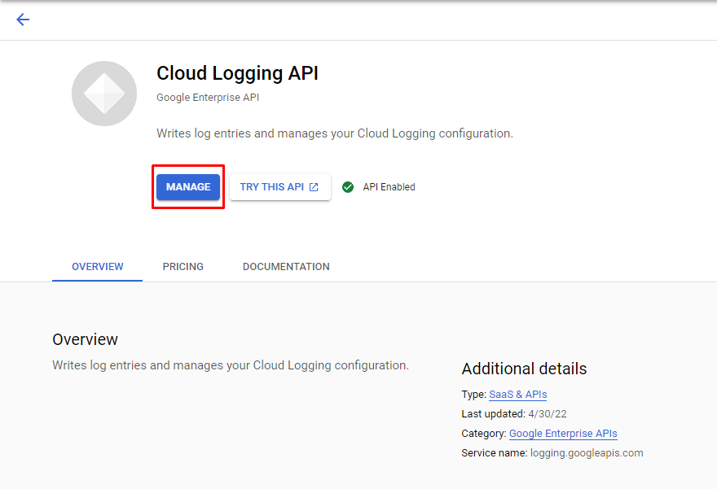
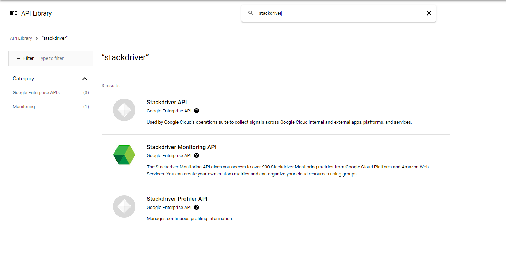

## Google Cloud Platform (GCP -> GKE)

1. Search Kubernetes Engine and Create a cluster
2. Open Activate Cloud Shell to Run a Command

3. Press Connect cluster button copy command and paste into shell


#### How to deploy an app ?

1. Create a deployment named hello-world that runs the **muratcanabay/hello-world:0.0.2-SNAPSHOT** image
```
kubectl create deployment hello-world --image=docker.io/muratcanabay/hello-world:0.0.2-SNAPSHOT
```

2. Create a service for a hello-world deployment, which serves on port 8081 and configure LoadBalancer
```
kubectl expose deployment hello-world --type=LoadBalancer --port=8081
```

3. To check availability of your container, go to Services & Ingress 


#### Pods
Smallest deployable unit in k8s. <br>
Pod is a collection of containers that can run on a host.

#### Replica Set
Always keeps monitoring pods and if there are lesser number of pods exists than needed then it creates new pod.
* Delete pod to see auto creation if desired lesser than current. 


##### Adjust number of replica sets

```
kubectl scale deployment hello-world --replicas=3
```


#### How to update deployment ?
```
kubectl set image deployment deploymentName containerName=muratcanabay/hello-world:0.0.2-SNAPSHOT

kubectl set image deployment hello-world hello-world=muratcanabay/hello-world:0.0.2-SNAPSHOT
```


#### What is Service in Kubernetes

Pods are throw away units in Kubernetes world.<p>
Its IP address might change, they might go down but user side of the application doesn't get affected due to the service.

* **ClusterIP**: Exposes a service which is only accessible from within the cluster.
* **LoadBalancer**: Exposes the service via the cloud provider’s load balancer.


### Master Node and Worker Node


<br>
Master node manages cluster.


<br>Worker node runs your application.

### YAML Configuration File

```
kubectl get deployments -o yaml
kubectl get deployment hello-world -o yaml >> deployment.yaml

kubectl get services -o yaml
kubectl get service hello-world -o yaml >> service.yaml
```

##### Merge deployment.yaml & service.yaml [Merged File](03merged.yaml)

Add to service.yaml under the deployment.yaml putting --- between those file to manage declarations from single file.
<br>
Then you may clean unnecessary part of the .yaml.
```
kubectl apply -f 04cleaned.yaml
```

### Delete Deployment, Service, Pod, Replicaset By Label

```
kubectl delete all -l app=hello-world
```

### Add environment variable

Add env array below spec->spec->containers . Configmaps are much more preferred way. 

```yaml
env:
    - name: HELLO_WORLD
      value: "Hello from the environment"
```

### Config Map [Configmap](06configmap.yaml)

Configmap is a kubernetes object that allows the configurations we use in our applications to be placed outside and easily managed from a single point.

```
kubectl get configmap
kubectl get configmap -o yaml
```

* **Create Config Map** [Configmap](07cleaned-with-configmap.yaml)
```
kubectl create configmap hello-world-configmap --from-literal=HELLO_WORLD="Hello from the environment"

kubectl get configmap hello-world-configmap -o yaml >> configmap.yaml

kubectl apply -f 07cleaned-with-configmap.yaml
```

### Logging and Tracing APIs

Search Cloud Logging API and manage.

<br>
Search stackdriver and enable all of them.


#### Liveness and Readiness Probes [File](08cleaned-with-probes.yaml)

Readiness probe is not successful, no traffic is sent.<br>
Liveness probe is not successful, pod is restarted.<br><br>

Probes are important for **zero downtime** when new version of application deployed. K8s checks probes to discover new version is ready.
Spring Boot actuator has these configurations. Change .yaml to enable the probes.

```yaml
livenessProbe:
  httpGet:
    path: /actuator/health/liveness
    port: 8080
readinessProbe:
  httpGet:
    path: /actuator/health/readiness
    port: 8080
```

### Autoscaling

```
kubectl autoscale deployment hello-world --min=1 --max=3 --cpu-percent=70

kubectl get hpa
```

### KubeCtl

1. Kube Controller version
```
kubectl version
```

2. See events
```
kubectl get events
```

3. See Pods
```
kubectl get pods

kubectl get pods -o wide

kubectl describe pod hello-world-57c74fbc6d-kv2m9

kubectl delete pod hello-world-57c74fbc6d-kv2m9
```

4. See Replica Set
```
kubectl get replicaset

kubectl get rs

kubectl get rs -o wide
```

5. See Deployment
```
kubectl get deployment
```

6. See Service
```
kubectl get service
```

7. See Statuses
```
kubectl get componentstatuses
```

8. See Horizontal Pod Autoscaler
```
kubectl get hpa
```

9. See Metrics of Nodes(CPU, Memory)
```
kubectl top node
```

* Send Request 
```shell
curl http://34.134.255.43:8081
watch -n 0.1 curl http://34.134.255.43:8081 #Sends a request every 0.1sec
```